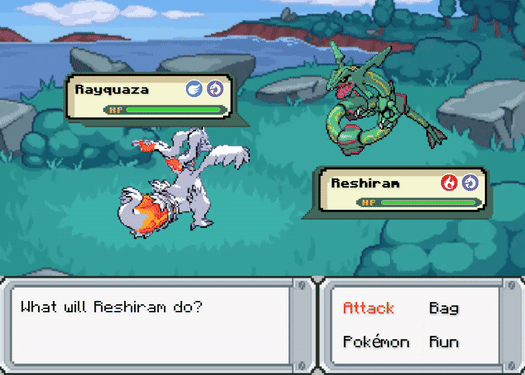

*On par with [**eesuhn.Pokemon**](https://github.com/eesuhn/Pokemon)* 

1. Based on results from `ResTest` ([*More Info*](https://github.com/eesuhn/Pokemon/blob/main/README.md#background-work-%EF%B8%8F))  
	Input list of *Pokemon* and *Moves* to `main.py` in `pokes, pokes-static, sfx-moves`
2. Bash `run.sh` to scrap, manipulate, and move assets to `$HOME/Pokemon`

<i>*Assuming you using Linux :))</i>
